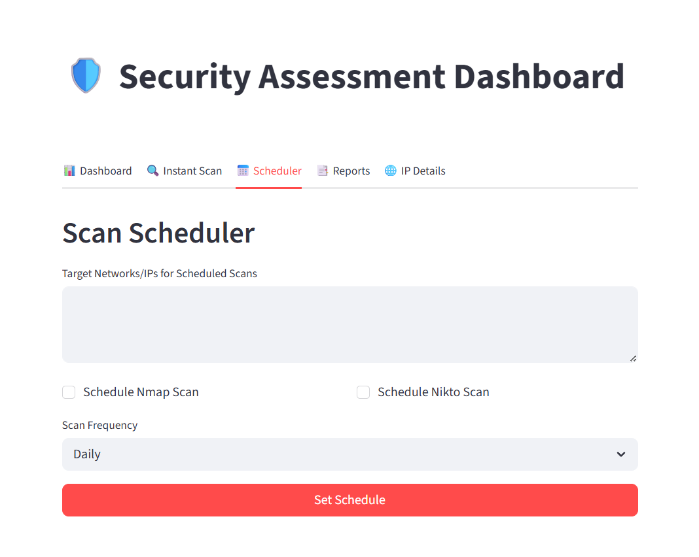

# 🛡️ ScanPulse - Automated Detection and Security Assessment Tool

ScanPulse is a web-based security dashboard that scans target IPs, identifies vulnerabilities, and generates PDF reports automatically.

## What it does
- Runs Nmap scans to detect open ports and services
- Looks up real CVE data from the NVD database
- Generates a professional VAPT report as a PDF
- Displays vulnerability charts and trends on a dashboard

## Screenshots

## Tech Used
Python, Streamlit, Nmap, Nikto, ReportLab, Plotly, NVD API

## Setup
- Install Python 3.10+ and Nmap
- Install dependencies: `pip install streamlit pandas plotly reportlab lxml requests python-dotenv seaborn matplotlib numpy`
- Add your NVD API key in a `.env` file: `API_KEY=your_key_here`
- Run: `streamlit run main.py`

## Sample Report
A sample redacted report is included in the repo.

## Disclaimer
Only use on systems you own or have permission to scan.
